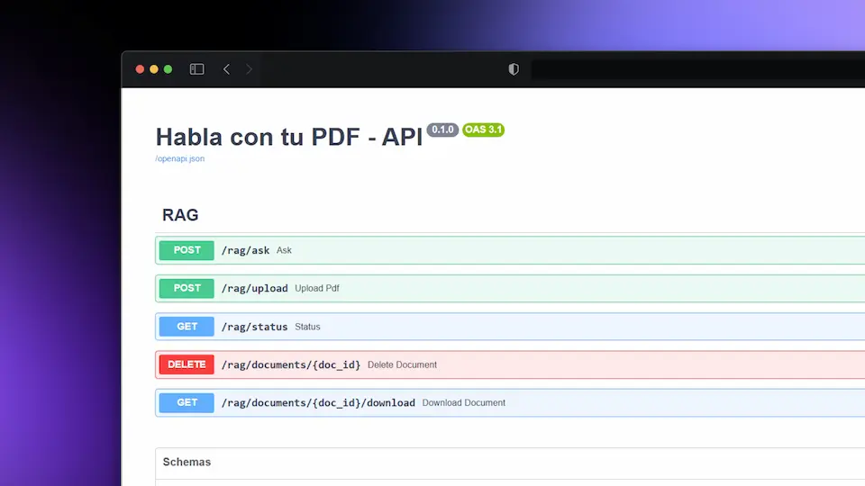

# 📄 Habla con tu PDF - Backend

<p align="center">
  
</p>

Un sistema RAG (Retrieval-Augmented Generation) que permite subir documentos PDF y hacer preguntas sobre su contenido usando inteligencia artificial.

## 🚀 Características

- **Carga de PDFs**: Subida y procesamiento automático de documentos PDF
- **Chat inteligente**: Conversación natural sobre el contenido de los documentos
- **Búsqueda semántica**: Encuentra información relevante usando embeddings vectoriales
- **Gestión de documentos**: CRUD completo para administrar los PDFs subidos
- **Detección de duplicados**: Evita procesar archivos duplicados automáticamente
- **API REST**: Interfaz completa para integración con frontends
- **Base de datos vectorial**: Almacenamiento eficiente con ChromaDB
- **Procesamiento en segundo plano**: Indexación asíncrona de documentos

## 🛠�?Tecnologías

- **Framework**: FastAPI
- **IA**: Google Gemini (Chat + Embeddings)
- **RAG**: LangChain
- **Base de datos vectorial**: ChromaDB
- **Procesamiento PDF**: PyPDF
- **Gestión de dependencias**: Poetry
- **Lenguaje**: Python 3.13+

## 📋 Requisitos previos

- Python 3.13 o superior
- Clave API de Google AI (Gemini)
- Poetry (recomendado) o pip

## ⚙️ Instalación

### 1. Clonar el repositorio

```bash
git clone https://github.com/WillJkdev/habla-con-tu-pdf.git
cd habla-con-tu-pdf/backend
```

### 2. Instalar dependencias

**Con Poetry (recomendado):**

```bash
poetry install
poetry env activate
```

**Con pip:**

```bash
pip install -r requirements.txt
```

### 3. Configurar variables de entorno

Crear un archivo `.env` en la raíz del proyecto:

```env
GOOGLE_API_KEY=tu_clave_api_de_google
```

Para obtener una clave API:

1. Ve a [Google AI Studio](https://makersuite.google.com/app/apikey)
2. Crea una nueva clave API
3. Cópiala al archivo `.env`

## 🚀 Uso

### Iniciar el servidor

```bash
# Con Poetry
poetry run fastapi dev src/main.py

# Con Python directo
fastapi dev src/main.py
```

El servidor estará disponible en: `http://localhost:8000`

### Documentación de la API

- **Swagger UI**: `http://localhost:8000/docs`
- **ReDoc**: `http://localhost:8000/redoc`

## 📚 Endpoints de la API

### Subir documento

```http
POST /rag/upload
Content-Type: multipart/form-data

file: [archivo.pdf]
```

### Hacer pregunta

```http
POST /rag/ask
Content-Type: application/json

{
  "question": "¿De qué trata el documento?",
  "doc_id": "opcional-id-documento"
}
```

### Ver estado y documentos

```http
GET /rag/status
```

### Eliminar documento

```http
DELETE /rag/documents/{doc_id}
```

### Descargar documento

```http
GET /rag/documents/{doc_id}/download
```

## 📁 Estructura del proyecto

```
backend/
├── src/
�?  ├── __init__.py
�?  ├── main.py              # Punto de entrada de la aplicación
�?  ├── config.py            # Configuración y variables de entorno
�?  ├── models/
�?  �?  └── schemas.py       # Modelos Pydantic para la API
�?  ├── routes/
�?  �?  └── rag_routes.py    # Endpoints de la API RAG
�?  ├── services/
�?  �?  └── rag_service.py   # Lógica de negocio principal
�?  ├── db/
�?  �?  └── chroma_db.py     # Gestión de ChromaDB
�?  └── utils/
�?      ├── file_manager.py  # Gestión de archivos
�?      ├── index_manager.py # Gestión del índice de documentos
�?      ├── pdf_loader.py    # Carga de PDFs
�?      └── pdf_processor.py # Procesamiento de PDFs
├── data/
�?  └── pdfs/               # Almacenamiento de archivos PDF
├── chroma_db/              # Base de datos vectorial
├── pyproject.toml          # Configuración de Poetry
├── requirements.txt        # Dependencias pip
└── README.md
```

## ⚙️ Configuración avanzada

El archivo `src/config.py` permite personalizar:

```python
class Settings(BaseSettings):
    GOOGLE_API_KEY: Optional[SecretStr] = None
    CHROMA_PERSIST_DIR: str = "./chroma_db"
    CHUNK_SIZE: int = 1000              # Tamaño de chunks de texto
    CHUNK_OVERLAP: int = 200            # Solapamiento entre chunks
    K: int = 2                          # Número de chunks relevantes
    EMBEDDING_MODEL: str = "models/embedding-001"
    CHAT_MODEL: str = "gemini-2.5-pro-exp-03-25"
```

## 🐳 Docker (opcional)

```dockerfile
FROM python:3.13-slim

WORKDIR /app

COPY pyproject.toml poetry.lock ./
RUN pip install poetry && poetry install --no-dev

COPY . .

EXPOSE 8000

CMD ["poetry", "run", "uvicorn", "src.main:app", "--host", "0.0.0.0", "--port", "8000"]
```

## 🔧 Desarrollo

### Ejecutar tests

```bash
poetry run pytest
```

### Linting

```bash
poetry run black .
poetry run flake8 .
```

### Estructura de desarrollo

- **main.py**: Configuración de FastAPI y CORS
- **rag_service.py**: Lógica principal del RAG
- **chroma_db.py**: Abstracción de ChromaDB
- **pdf_processor.py**: Procesamiento y división de PDFs
- **file_manager.py**: Gestión del sistema de archivos
- **index_manager.py**: Gestión del índice de documentos

## 🚨 Solución de problemas

### Error: "Falta GOOGLE_API_KEY en .env"

- Asegúrate de tener el archivo `.env` con tu clave API de Google

### Error: "No se pueden extraer chunks del PDF"

- Verifica que el PDF no esté corrupto o protegido con contraseña

### Error de memoria con PDFs grandes

- Reduce `CHUNK_SIZE` en `config.py`
- Considera dividir PDFs muy grandes

### Problemas con ChromaDB

- Elimina la carpeta `chroma_db/` para reiniciar la base de datos
- Verifica permisos de escritura en el directorio

## 📄 Licencia

Este proyecto está bajo la Licencia MIT. Ver el archivo [LICENSE](LICENSE) para más detalles.

## 🤝 Contribuir

1. Fork el proyecto
2. Crea una rama para tu feature (`git checkout -b feature/nueva-funcionalidad`)
3. Commit tus cambios (`git commit -am 'Agregar nueva funcionalidad'`)
4. Push a la rama (`git push origin feature/nueva-funcionalidad`)
5. Abre un Pull Request

## 📞 Contacto

- **Proyecto**: Habla con tu PDF
- **Repositorio**: [GitHub](link-al-repositorio)

## 🙏 Agradecimientos

- [LangChain](https://python.langchain.com/) por el framework RAG
- [FastAPI](https://fastapi.tiangolo.com/) por el framework web
- [ChromaDB](https://www.trychroma.com/) por la base de datos vectorial
- [Google AI](https://ai.google.dev/) por los modelos de IA
