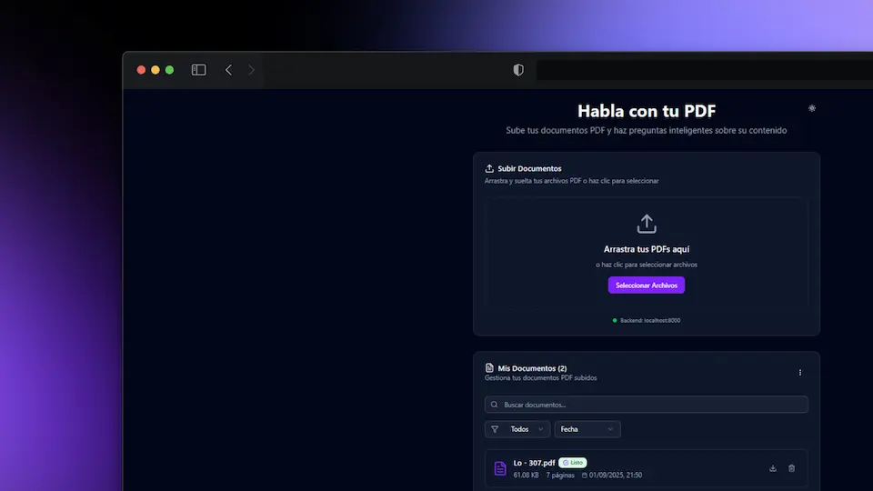

# 📄 Habla con tu PDF

<p align="center">
  
</p>

Una aplicación web moderna e intuitiva que te permite subir documentos PDF y hacer preguntas inteligentes sobre su contenido utilizando inteligencia artificial.

## ✨ Características

- 🚀 **Interfaz moderna y responsiva** construida con Next.js 15 y Tailwind CSS
- 📱 **Diseño adaptable** que funciona perfectamente en desktop y móvil
- 🎨 **Modo oscuro/claro** con toggle de tema integrado
- 📄 **Soporte completo para PDF** con drag & drop
- 🤖 **Chat inteligente** con IA para hacer preguntas sobre tus documentos
- 💾 **Gestión de documentos** con filtrado, búsqueda y ordenamiento
- 📊 **Indicadores de estado** en tiempo real del procesamiento
- 💬 **Historial de conversaciones** persistente por documento
- ⬇️ **Descarga de documentos** directamente desde la interfaz
- 🗑️ **Eliminación selectiva** de documentos y conversaciones

## 🛠️ Tecnologías Utilizadas

### Frontend

- **Next.js 15** - Framework de React con App Router
- **React 19** - Biblioteca de interfaz de usuario
- **TypeScript** - Tipado estático para JavaScript
- **Tailwind CSS 4** - Framework de CSS utilitario
- **Radix UI** - Componentes accesibles y sin estilos
- **Lucide React** - Iconos modernos
- **Sonner** - Notificaciones toast elegantes
- **next-themes** - Gestión de temas oscuro/claro

### Herramientas de Desarrollo

- **ESLint** - Linting de código
- **PostCSS** - Procesamiento de CSS
- **Turbopack** - Bundler ultra-rápido

## 🚀 Instalación y Configuración

### Prerrequisitos

- Node.js 18.17 o superior
- npm o yarn
- Backend API ejecutándose en `http://localhost:8000`

### Pasos de Instalación

1. **Clona el repositorio**

   ```bash
   git clone https://github.com/WillJkdev/habla-con-tu-pdf.git
   cd habla-con-tu-pdf/frontend
   ```

2. **Instala las dependencias**

   ```bash
   npm install
   # o
   yarn install
   ```

3. **Configura las variables de entorno (opcional)**

   ```bash
   # Crea un archivo .env.local si necesitas configuraciones específicas
   echo "NEXT_PUBLIC_API_URL=http://localhost:8000" > .env.local
   ```

4. **Ejecuta la aplicación en modo desarrollo**

   ```bash
   npm run dev
   # o
   yarn dev
   ```

5. **Abre tu navegador**

   Visita [http://localhost:3000](http://localhost:3000) para ver la aplicación.

## 🎯 Uso de la Aplicación

### 1. Subir Documentos PDF

- **Arrastra y suelta** archivos PDF en la zona de carga
- **Haz clic** en "Seleccionar archivos" para abrir el explorador
- Los documentos se procesan automáticamente y muestran su estado

### 2. Gestionar Documentos

- **Busca** documentos por nombre
- **Filtra** por estado (Todos, Listos, Procesando, Fallidos)
- **Ordena** por nombre, fecha, tamaño o estado
- **Descarga** documentos originales
- **Elimina** documentos individuales o todos a la vez

### 3. Chat con IA

- **Selecciona** un documento específico o "Todos los documentos"
- **Escribe** tu pregunta en el área de texto
- **Presiona Enter** o haz clic en "Enviar" para obtener respuestas
- El historial se guarda automáticamente por documento

### 4. Gestión de Conversaciones

- **Limpia** el chat actual
- **Elimina** todo el historial de conversaciones
- Las conversaciones se restauran automáticamente al cambiar entre documentos

## 📁 Estructura del Proyecto

```
src/
├── app/                    # App Router de Next.js
│   ├── globals.css        # Estilos globales
│   ├── layout.tsx         # Layout principal
│   ├── loading.tsx        # Componente de carga
│   └── page.tsx           # Página principal
├── components/            # Componentes React
│   ├── ui/               # Componentes de UI reutilizables
│   ├── AppHeader.tsx     # Header de la aplicación
│   ├── ChatInterface.tsx # Interfaz de chat
│   ├── DocumentManagement.tsx # Gestión de documentos
│   ├── ThemeProvider.tsx # Proveedor de temas
│   ├── ThemeToggle.tsx   # Toggle de tema
│   └── UploadSection.tsx # Sección de carga
├── hooks/                # Custom hooks
│   └── usePDFChat.ts     # Hook principal de la aplicación
├── lib/                  # Utilidades y servicios
│   ├── api.ts           # Servicio de API
│   ├── chat-storage.ts  # Almacenamiento de conversaciones
│   ├── types.ts         # Definiciones de tipos
│   ├── utils.ts         # Utilidades generales
│   └── utils/           # Utilidades específicas
└── public/              # Archivos estáticos
```

## 🔧 Scripts Disponibles

```bash
# Desarrollo con Turbopack
npm run dev

# Construcción para producción
npm run build

# Iniciar servidor de producción
npm run start

# Linting de código
npm run lint
```

## 🌐 API Endpoints

La aplicación se conecta con un backend que debe exponer los siguientes endpoints:

- `POST /rag/upload` - Subir documentos PDF
- `GET /rag/status` - Obtener estado de documentos
- `DELETE /rag/documents/{doc_id}` - Eliminar documento
- `POST /rag/ask` - Hacer preguntas sobre documentos
- `GET /rag/documents/{doc_id}/download` - Descargar documento

## 🎨 Personalización

### Temas

La aplicación incluye soporte completo para temas oscuro y claro usando `next-themes`. Los temas se pueden personalizar editando las variables CSS en `globals.css`.

### Componentes UI

Los componentes de interfaz están basados en Radix UI y se pueden personalizar fácilmente. Se encuentran en `src/components/ui/`.

### Estilos

Utiliza Tailwind CSS 4 para estilos. Puedes personalizar la configuración en `tailwind.config.js`.

## 📱 Características Responsivas

- **Desktop**: Interfaz completa con todas las funcionalidades
- **Tablet**: Adaptación optimizada para pantallas medianas
- **Móvil**: Experiencia táctil optimizada con navegación simplificada

## 🔒 Seguridad

- Validación de tipos de archivo (solo PDF)
- Detección de duplicados
- Manejo seguro de errores
- Sanitización de datos de entrada

## 🚧 Desarrollo

### Estructura de Componentes

- **Componentes modulares** y reutilizables
- **Custom hooks** para lógica de negocio
- **TypeScript estricto** para type safety
- **Gestión de estado** con React hooks

### Mejores Prácticas

- Código limpio y bien documentado
- Separación de responsabilidades
- Manejo de errores robusto
- Optimización de rendimiento

## 🤝 Contribución

1. Fork el proyecto
2. Crea una rama para tu feature (`git checkout -b feature/AmazingFeature`)
3. Commit tus cambios (`git commit -m 'Add some AmazingFeature'`)
4. Push a la rama (`git push origin feature/AmazingFeature`)
5. Abre un Pull Request

## 📝 Licencia

Este proyecto está bajo la licencia MIT. Ver el archivo [LICENSE](LICENSE) para más detalles.

## 🐛 Reporte de Bugs

Si encuentras algún bug o tienes una sugerencia, por favor:

1. Verifica que no exista un issue similar
2. Crea un nuevo issue con:
   - Descripción clara del problema
   - Pasos para reproducirlo
   - Comportamiento esperado vs actual
   - Screenshots si es relevante

## 📞 Soporte

Para soporte técnico o preguntas sobre el proyecto:

- Crea un issue en GitHub
- Revisa la documentación de la API
- Verifica que el backend esté ejecutándose correctamente

## 🔄 Roadmap

### Próximas Características

- [ ] Soporte para múltiples formatos de documento
- [ ] Exportación de conversaciones
- [ ] Búsqueda avanzada en documentos
- [ ] Integración con servicios de almacenamiento en la nube
- [ ] API de webhooks para notificaciones
- [ ] Modo colaborativo

---

**Desarrollado con ❤️ usando Next.js y React**